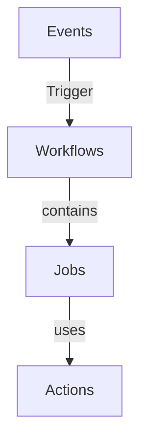

# Training Notes
{: .no_toc }


## Table of contents
{: .no_toc .text-delta }

1. TOC
{:toc}

<br/>

---

<br/>

## Resources

Here are presented totally free digital resources in web format (Web Sites, Blogs, ...), ebooks and newsletters.

> Note: All links have been tested. If a link does not work, the author has stopped providing the information.

<br/>

## Interactive Guides

No content.

<!-- 
| Topic | Guide |
| :---: | ---   | 
| - - - | - - - |

--> 


<br/>

## Day one

```
Trainer resources: https://az-400.rramoscabral.com/

Course manual: https://az-400.rramoscabral.com/docs/CourseSyllabus202405.html

View Azure Pass balance: https://www.microsoftazuresponsorships.com/Balance


------------------------------------------

[DevOps]

- Donovan Brown: https://twitter.com/donovanbrown
- What is DevOps? with Donovan Brown: https://devblogs.microsoft.com/devops/what-is-devops-donovan/
- Donovan Brown Slide Decks (erro de certificado): https://www.donovanbrown.com/page/slide-decks
- What is DevOps?: https://learn.microsoft.com/en-us/devops/what-is-devops

------------------------------------------

Agile principles
- https://agilemanifesto.org/iso/ptpt/principles.html
- https://www.agilealliance.org/agile101/the-agile-manifesto/

------------------------------------------


Azure DevOps (Empresarial)
https://dev.azure.com/[organização]/[projeto]

GitHub (Open-Source / Colaborativo / Empresarial) 
https://www.github.com/[username/organização]/[repositorio]
  - Username: Pessoa
  - Organização: conta organizativa


------------------------------------------

[GIT]

ebook: https://git-scm.com/book/en/v2

------------------------------------------

[Semantic Versioning]

https://semver.org/

   - Nova Aplicação:  1.0.0
   - Bug fix:  1.0.1
   - Nova funcionalidade:  1.1.1
   - Restruturação da aplicação imcompatível com a anterior:  2.0.0


-----------------

[Git Large File Storage (LFS)]

Git extension for versioning large files: https://git-lfs.com/

https://docs.github.com/en/repositories/working-with-files/managing-large-files/about-large-files-on-github


```

---

## Day Two

**GitHub Workflows**

<br/>

**GitHub Actions flow**


> Graph made using Mermaid markdown

<br/>

**Syntax elements**

* **Name:** The name of the workflow. GitHub displays the names of your workflows under your repository's "Actions" tab. If you omit name, GitHub displays the workflow file path relative to the root of the repository.
* **On:** To automatically trigger a workflow, use on to define which events can cause the workflow to run
* **Jobs:** A workflow run is made up of one or more jobs, which run in parallel by default. 
* **Runs-on:** Use jobs.<job_id>.runs-on to define the type of machine to run the job on.
* **Steps:** A job contains a sequence of tasks called steps. Steps can run commands, run setup tasks, or run an action in your repository, a public repository, or an action published in a Docker registry. Not all steps run actions, but all actions run as a step.
* **Uses:** Selects an action to run as part of a step in your job. An action is a reusable unit of code. You can use an action defined in the same repository as the workflow, a public repository, or in a published Docker container image.
* **Run:** Runs command-line programs that do not exceed 21,000 characters using the operating system's shell. If you do not provide a name, the step name will default to the text specified in the run command.

> Source: https://docs.github.com/en/actions/using-workflows/workflow-syntax-for-github-actions

<br/>


**Workflow Status badge**

Example from [blank.yml](https://raw.githubusercontent.com/CloudAndDevelopment/GitHubWorkflows/main/.github/workflows/blank.yml)

[](https://github.com/CloudAndDevelopment/GitHubWorkflows/actions/workflows/blank.yml)


```

-----------------


Using the Agile Testing Quadrants: https://lisacrispin.com/2011/11/08/using-the-agile-testing-quadrants/

-----------------

Memaid Live editor: https://mermaid.live/edit

-----------------

```


---

## Day Three